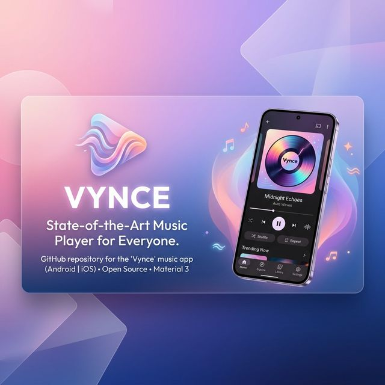
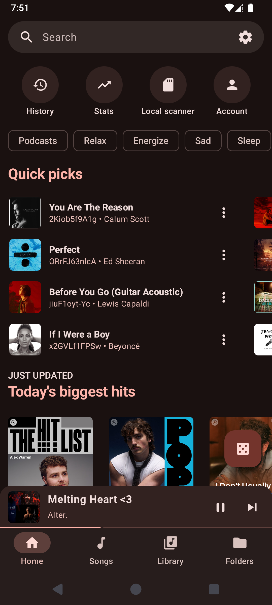
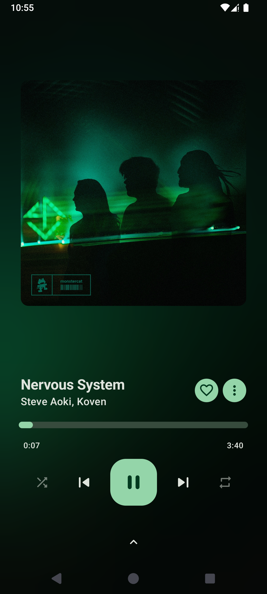
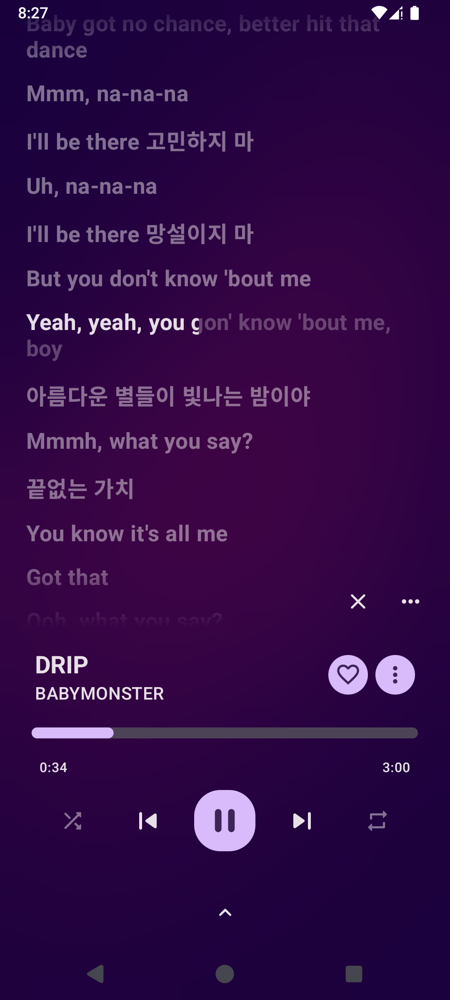
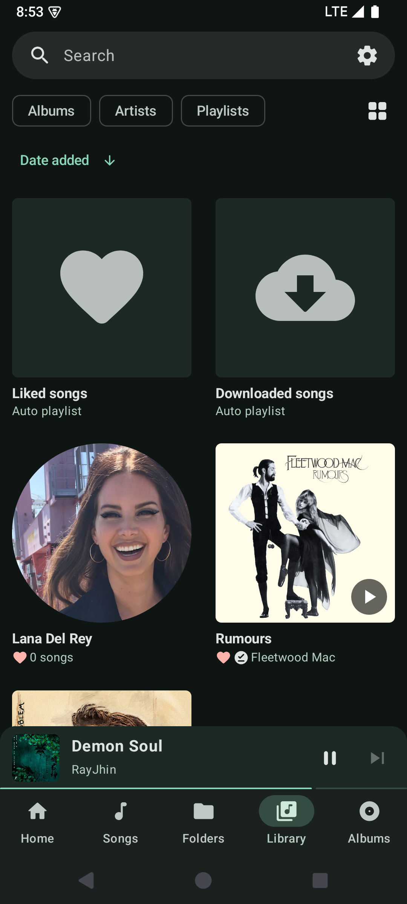
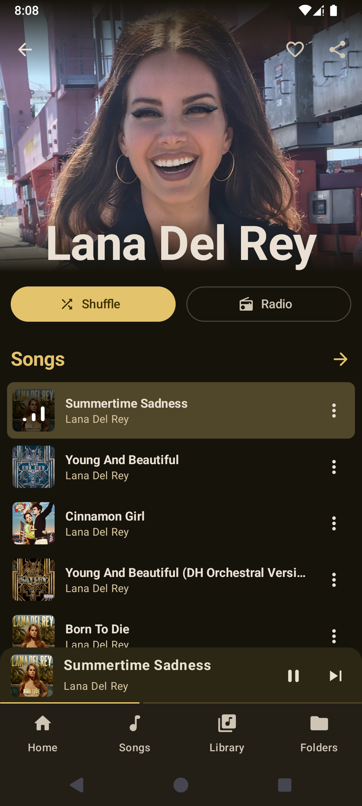
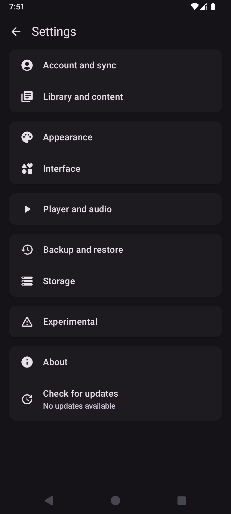

  
  <h1>Vynce</h1>
  
<b>The ultimate premium Music Experience for Android</b>

  
  
  

---

Vynce is a high-performance, Material 3-based music player designed for audiophiles. Seamlessly stream millions of tracks from JioSaavn or play your local high-fidelity collection with a beautiful, modern interface.

### ✨ Key Features
- 🎵 **Unlimited Streaming**: Access 100M+ songs at **320kbps** via the JioSaavn database.
- 🎨 **Modern Aesthetics**: Full Material 3 support with **Dynamic Colors** (Android 12+).
- 💿 **Album Art & Visuals**: Rotating vinyl effects, sleek transitions, and a built-in audio visualizer.
- 📂 **Local Library**: High-fidelity support for MP3, **FLAC**, OGG, and AAC.
- 📊 **Insightful Stats**: Dedicated dashboard for your listening habits.
- 💬 **Synchronized Lyrics**: Support for LRC and TTML synced lyrics.
- 📥 **Offline Mode**: Download your favorite tracks for listening anywhere.
- 🚗 **On the Road**: Full **Android Auto** integration.
- 📻 **Scrobbling**: Last.fm integration to keep your history synced.
- 🌙 **Smart Tools**: Sleep timer, audio normalization, and gapless playback.

---

### 📸 Screenshots

  <table>
    <tr>
      <td width="33%"></td>
      <td width="33%"></td>
      <td width="33%"></td>
    </tr>
    <tr>
      <td align="center"><b>Home</b></td>
      <td align="center"><b>Now Playing</b></td>
      <td align="center"><b>Synced Lyrics</b></td>
    </tr>
       <tr>
      <td width="33%"></td>
      <td width="33%"></td>
      <td width="33%"></td>
    </tr>
    <tr>
      <td align="center"><b>Library</b></td>
      <td align="center"><b>Artist</b></td>
      <td align="center"><b>Settings</b></td>
    </tr>
  </table>

---

### 🛠 Tech Stack
- **Language**: Kotlin
- **UI Framework**: Jetpack Compose
- **Core**: Media3 & ExoPlayer
- **Database**: Room
- **Networking**: OkHttp & Retrofit
- **Dependency Injection**: Hilt

---

### 🚀 Get Started
1. **Download**: Grab the latest APK from the [Releases](https://github.com/2300030811/Vynce/releases/latest) page.
2. **Install**: Enable "Install from Unknown Sources" on your device.
3. **Enjoy**: Open Vynce and start your journey through music.

---

### 🤝 Contributing
Contributions are welcome! Feel free to open issues or submit pull requests.

### 📜 License
This project is licensed under the **GPL-3.0 License**.