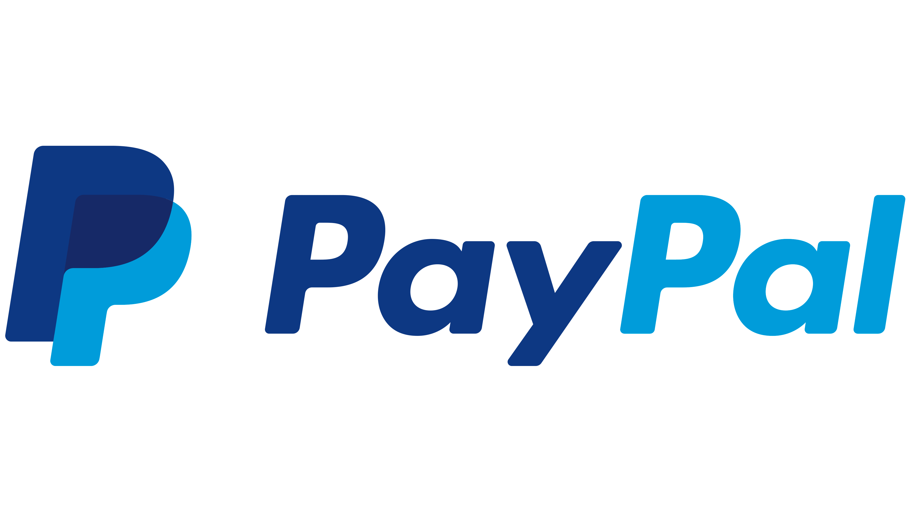

#  Vynce

### A Premium Material 3 YouTube Music Client & Local Player for Android

**Vynce** is a supercharged, modern music experience for Android. Built as a feature-rich fork of [InnerTune](https://github.com/z-huang/InnerTune), it combines the power of a YouTube Music client with the flexibility of a high-end local media player, all wrapped in a stunning Material You interface.

---

## ✨ Key Features

Vynce is designed to be the ultimate companion for your music library, whether it's online or offline.

### 🎧 The YouTube Music Experience
- **Seamless Playback**: No ADs, no interruptions.
- **Background Play**: Keep the music going while you do other things.
- **Full Sync**: Personalization that follows you; sync your account with ease.
- **Offline Mode**: Download your favorites for data-free listening.

### 📁 Advanced Local Player
- **Format Support**: Plays MP3, OGG, FLAC, and more.
- **Custom Tagging**: Uses a custom metadata extractor to fix the common "MediaStore" issues.
- **Unified Library**: Play your local files and YouTube Music tracks side-by-side in one queue.

### 🎨 Stunning Interface & UX
- **Material 3 (Material You)**: Dynamic colors that adapt to your wallpaper.
- **Sleek Layouts**: Modern, fluid UI with premium micro-interactions.
- **Lyrics Support**: Synchronized, word-by-word karaoke-style lyrics (LRC, TTML).
- **Audio Effects**: Normalization, pitch adjustment, and advanced tempo control.

### 🚗 Modern Connectivity
- **Android Auto**: Take Vynce on the road with a dedicated interface.
- **Android Support**: Compatible with Android 8 (Oreo) and above.

---

## 📸 In-App Preview

  
  
  

*Check out the [full gallery](./assets/gallery) for more views.*

---

## 🚀 Getting Started

Vynce is currently in active development. You can find the latest builds below:

| Platform | Link |
| :--- | :--- |
| **GitHub Releases** | [Download APK](https://github.com/2300030811/Vynce/releases/latest) |
| **F-Droid** | [Get on F-Droid](https://f-droid.org/en/packages/com.vynce.app/) |
| **IzzyOnDroid** | [Get on IzzyOnDroid](https://apt.izzysoft.de/fdroid/index/apk/com.vynce.app) |

> [!WARNING]
> Vynce is only available on the official platforms listed above. Beware of clones or unofficial websites.

---

## 🛠️ Building & Contributing

We welcome contributions of all kinds! Whether you are a developer, a translator, or an enthusiast, we need your help.

1.  **Read the [Contributing Guide](./CONTRIBUTING.md)** for details on code standards and setup.
2.  **Submit Translations** via our [Weblate page](https://hosted.weblate.org/projects/Vynce/).

---

## ❤️ Support Us

If you love what we're building, consider supporting the continuous development of Vynce.

---

## 📜 Attribution & License

- **Base Project**: [z-huang/InnerTune](https://github.com/z-huang/InnerTune)
- **Inspiration**: [Musicolet](https://play.google.com/store/apps/details?id=in.krosbits.musicolet)
- **Lyrics Engine**: [Gramophone](https://github.com/FoedusProgramme/Gramophone)

This project is licensed under the **GNU GPL v3.0**.

---

## ⚠️ Disclaimer

Vynce is NOT affiliated with, authorized, or endorsed by YouTube or Google LLC. All trademarks belong to their respective owners.
